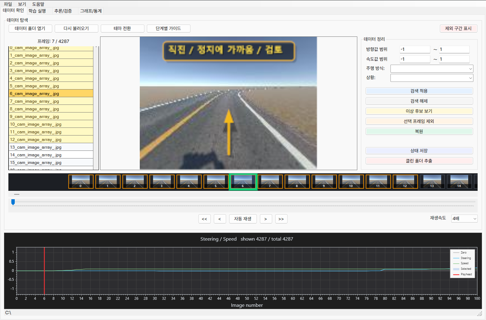
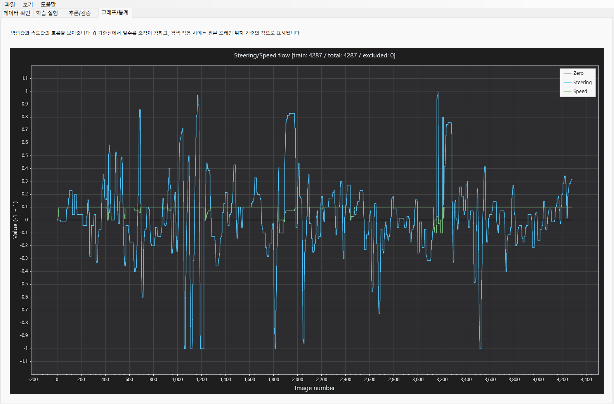
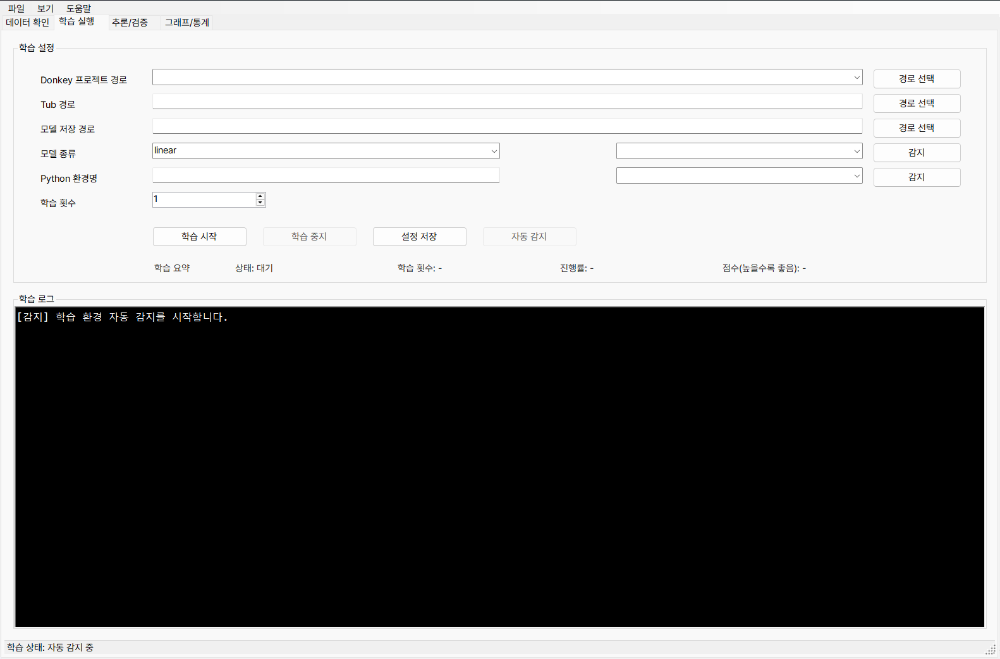
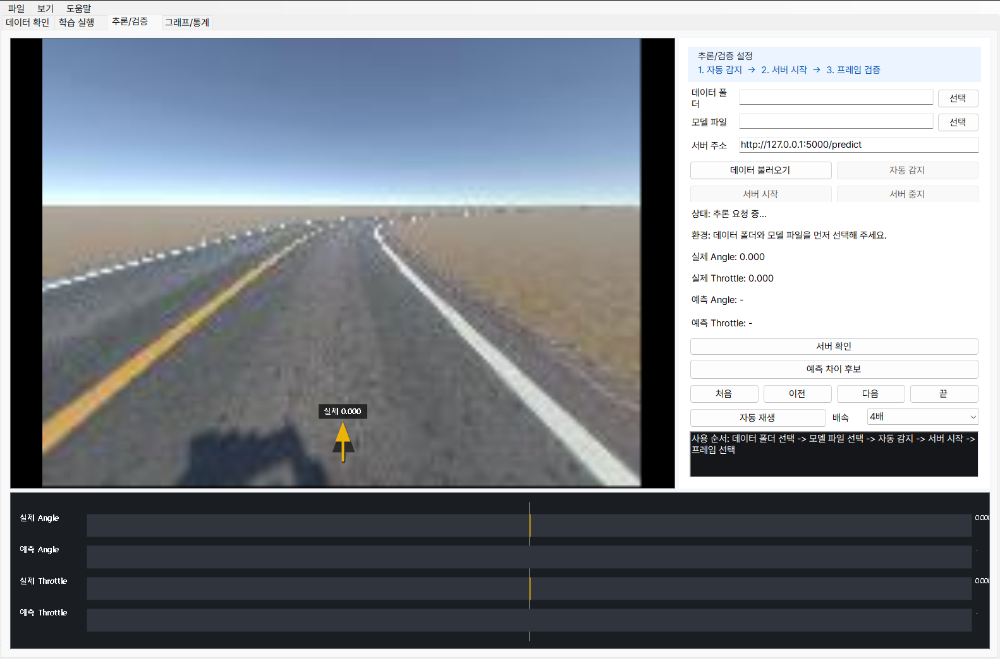

# 🚗 DonkeyCar Data Manager

> DonkeyCar 자율주행 학습 데이터를 분석하고 관리하기 위한 통합 데이터 관리 도구


---

# 📖 프로젝트 소개

DonkeyCar 프로젝트에서는 데이터 품질이 모델 성능에 큰 영향을 미칩니다.

하지만 기본 환경에서는 수집된 Tub 데이터를 확인하고, 이상 프레임을 찾고, 데이터를 정리한 뒤 다시 학습 및 검증하는 과정이 분산되어 있어 관리가 어렵습니다.

**DonkeyCar Data Manager**는 이러한 문제를 해결하기 위해 개발된 데이터 관리 도구로,

* 📂 데이터 확인
* 🧹 데이터 정리
* 📊 그래프 및 통계 분석
* 🤖 모델 학습
* 🔍 모델 검증

과정을 하나의 프로그램에서 수행할 수 있도록 설계되었습니다.

---

# 🎯 개발 목표

본 프로젝트의 목표는 단순히 모델을 학습시키는 것이 아니라,

> **"좋은 학습 데이터를 만들고, 그 결과를 검증할 수 있는 환경을 제공하는 것"**

입니다.

이를 통해

* 데이터 품질 향상
* 이상 데이터 탐색 효율 증가
* 학습 과정 단순화
* 검증 과정 자동화

를 목표로 합니다.

---

# 🛠️ 기술 스택

## Frontend

* C#
* WinForms (.NET)

## Backend

* Python
* DonkeyCar

## Environment

* WSL
* Conda
* Python Virtual Environment

## Data Processing

* Tub Dataset
* catalog_*.catalog Parser
* Image Processing

## Visualization

* Graph Viewer
* Statistics Dashboard
* Thumbnail Timeline

## Communication

* HTTP 기반 추론 서버
* Flask (Fallback 지원)

---

# ✨ 주요 기능



## 📂 데이터 확인

* Tub 데이터 로드
* catalog 파일 자동 분석
* 프레임 이미지 확인
* 썸네일 타임라인
* 자동 재생
* 1~10배속 재생
* 조향 방향 화살표 표시
* 주행 상태 오버레이

---

## 🧹 데이터 정리

* 프레임 제외 기능
* 제외 프레임 복원
* 제외 상태 저장
* 자동 복원
* 저장되지 않은 변경사항 경고

### Clean Dataset 생성

* 원본 Tub 복사
* 제외 프레임 제거
* catalog 정리
* 학습용 데이터셋 생성

---

## 🔎 검색 및 필터

* 조향값 범위 검색
* 속도값 범위 검색
* 주행 상태 필터
* 이상 프레임 후보 탐색

예시

* 급조향
* 정지 상태
* 비정상 속도
* 데이터 오류 의심 구간

---

## 📊 그래프 및 통계



* Steering 값 변화 그래프
* Throttle 값 변화 그래프
* 현재 프레임 위치 표시
* 필터 데이터 기준 분석

활용 예시

* 이상 구간 탐색
* 데이터 품질 검토
* 발표 자료 생성
* 데이터 정리 근거 확인

---

## 🤖 학습 실행



프로그램 내부에서 DonkeyCar 학습을 실행할 수 있습니다.

### 자동 감지

* WSL
* Conda
* Python 환경
* DonkeyCar 프로젝트 경로

### 지원 기능

* 학습 시작
* 학습 중지
* 로그 표시
* 진행률 표시
* 실시간 Loss 그래프

### 안전 저장

```text
임시 모델 생성
       ↓
학습 완료
       ↓
최종 모델 저장
```

기존 모델 손상을 최소화하도록 설계되었습니다.

---

## 🔍 추론 / 검증



학습된 모델을 실제 데이터에 적용하여 결과를 비교합니다.

### 제공 기능

* 추론 서버 실행
* 서버 상태 확인
* 모델 자동 감지
* 실제값 / 예측값 비교

### 비교 항목

* Steering
* Throttle

### 시각화

* 실제 방향 화살표
* 예측 방향 화살표
* 오차 그래프

### 오류 진단

* 포트 충돌
* 모델 경로 오류
* Python 환경 문제
* Conda 환경 누락
* WSL 오류
* 서버 응답 없음

---

## 📖 튜토리얼 및 도움말

처음 사용하는 사용자도 쉽게 접근할 수 있도록 안내 기능을 제공합니다.

### 튜토리얼 구성

1. 데이터 보기
2. 데이터 정리
3. 학습
4. 추론/검증
5. 그래프 분석

### UI 지원

* 단계별 안내
* 영역 강조 표시
* 기능 설명 툴팁

---

# 🛡️ 안전 장치

## 데이터 보호

* 원본 Tub 직접 수정 금지
* 제외 상태 별도 저장
* Clean Dataset 별도 생성

## 작업 보호

* 저장 여부 확인
* 자동 복원 지원

## 모델 보호

* 임시 모델 사용
* 중간 중단 시 손상 최소화
* 모델 백업 고려

---

# 🔄 전체 작업 흐름

```text
Tub 데이터 로드
        │
        ▼
프레임 검토
        │
        ▼
이상 프레임 제외
        │
        ▼
상태 저장
        │
        ▼
Clean Dataset 생성
        │
        ▼
모델 학습
        │
        ▼
Loss 확인
        │
        ▼
모델 검증
        │
        ▼
예측 결과 분석
```

---

# 💡 프로젝트 특징

### ✅ 데이터 중심 설계

모델 자체보다 데이터 품질 향상에 집중

### ✅ 원본 보존

원본 Tub 데이터를 직접 수정하지 않음

### ✅ 통합 환경 제공

데이터 분석부터 학습, 검증까지 하나의 프로그램에서 수행

### ✅ 시각적 분석 지원

그래프와 이미지 기반 분석 제공

### ✅ 초보자 친화적

튜토리얼 및 도움말 기능 제공

---

# 📄 License

본 프로젝트는 교육 및 연구 목적으로 개발되었습니다.